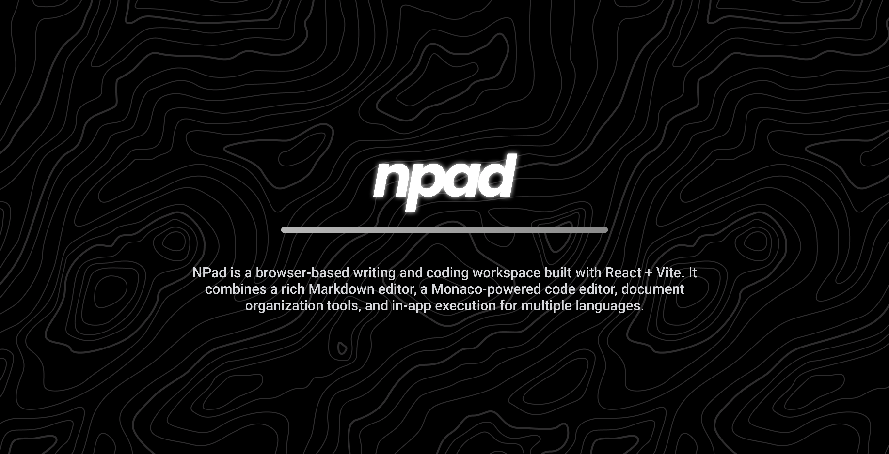

# NPad

NPad is a browser-based writing and coding workspace built with React + Vite. It combines a rich Markdown editor, a Monaco-powered code editor, document organization tools, and in-app execution for multiple languages.

## What The Website Does

- Create and manage drafts in a workspace-style UI
- Write documents in rich mode with Markdown shortcuts and live preview
- Switch to code mode with Monaco editor support
- Run code directly in the browser (JavaScript, TypeScript, Python, JSON, Markdown, and more)
- Step through and inspect MIPS programs with registers/memory views
- Organize documents with collections, tags, archive, trash, starred, and recent views
- Manage metadata like permissions, activity, and review status in the right panel
- Save and reuse custom document templates
- Export documents/code and share from the top bar actions

## Tech Stack

- React 19
- TypeScript
- Vite
- Monaco Editor (`@monaco-editor/react`)
- `marked` + `dompurify` for Markdown rendering/sanitization
- `lucide-react` for UI icons

## Run Locally

1. Install dependencies:
   ```bash
   npm install
   ```
2. Start the dev server:
   ```bash
   npm run dev
   ```
3. Build production assets:
   ```bash
   npm run build
   ```
4. Preview the production build:
   ```bash
   npm run preview
   ```

## Project Structure

- `App.tsx` - main app state and feature orchestration
- `components/` - UI components (sidebar, editors, top bar, right panel, modals)
- `types.ts` - shared TypeScript types
- `public/` - static assets (logo, etc.)

## Notes

- Data is persisted client-side via browser storage.
- No backend is required to run the current app locally.
